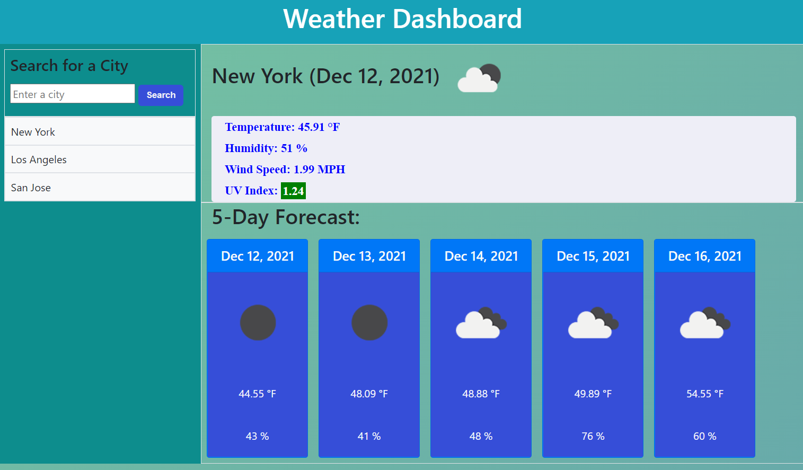

# Weather Dashboard

## Live Application Link

[Weather Dashboar](https://tringuyen1086.github.io/weather-dashboard-ultimate/)

## Project Visual

## Description

A web-based weather dashboard shows the current weather of selected city with the upcoming 5-day forecast.

## Instruction

- Enter a city to request for the weather update.
- Press Enter or Click on the Search Button to display the result.
- The result will include:
    + The current weather with Temperature, Humidity, Wind Speed, and UV Index.
    + The 5-day Forcast with Date, Weather, Temperature.
- UV Index is color coded to indicate the severity of the index.
    + Favorable - Green
    + Moderate - Yellow
    + Severe - Red
- Previous searches are saved in localStorage and are available as buttons in order for easy access and re-searching of weather and forecasts.

## Built With
* [x] HTML
* [x] CSS
* [x] Javascript
* [x] Open Weather APIs - Current Weather Data, UV Index and 5 day/ 3 Hour Forecast
* [x] Bootstrap API
* [x] Moment.js API

## Website
https://tringuyen1086.github.io/weather-dashboard-ultimate/
